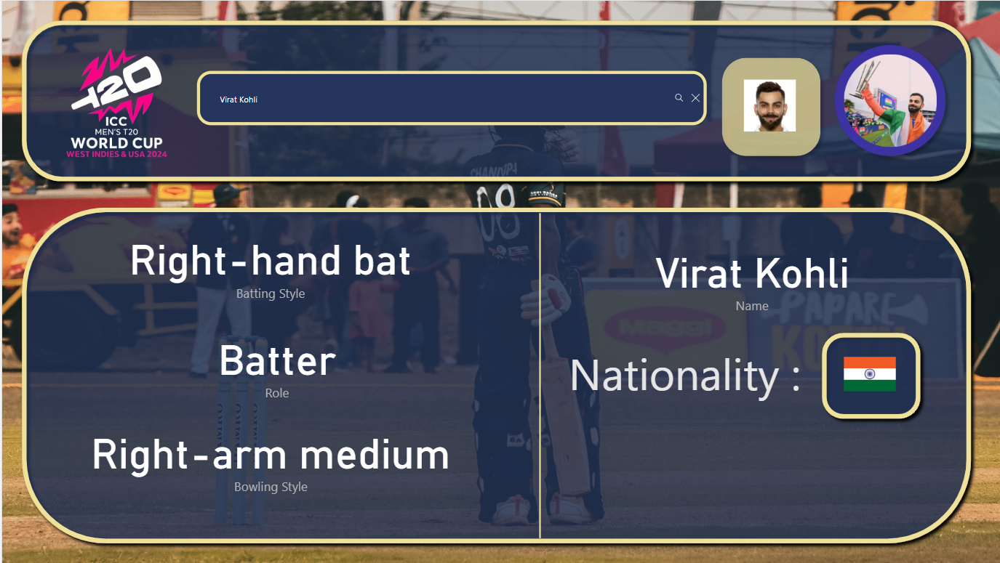
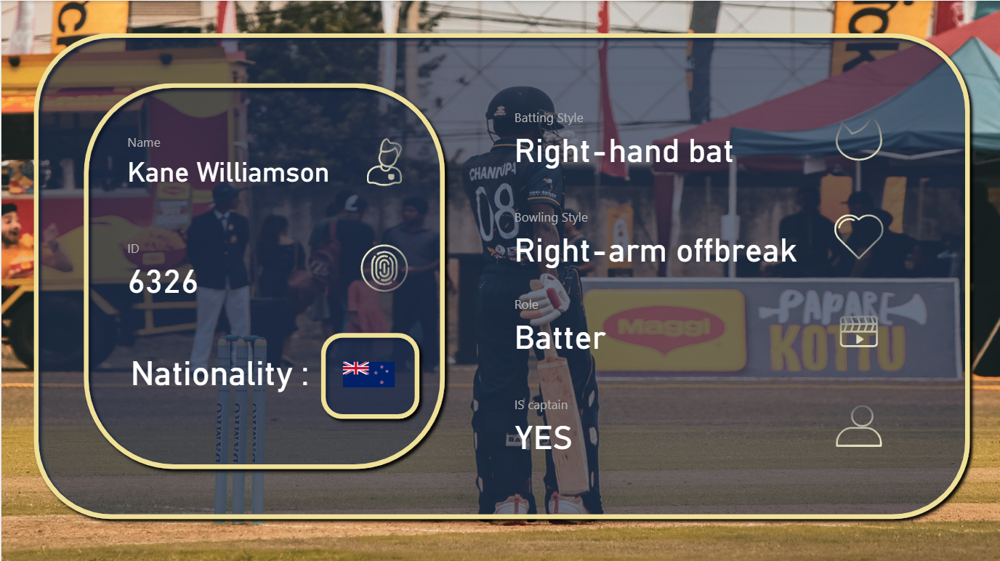
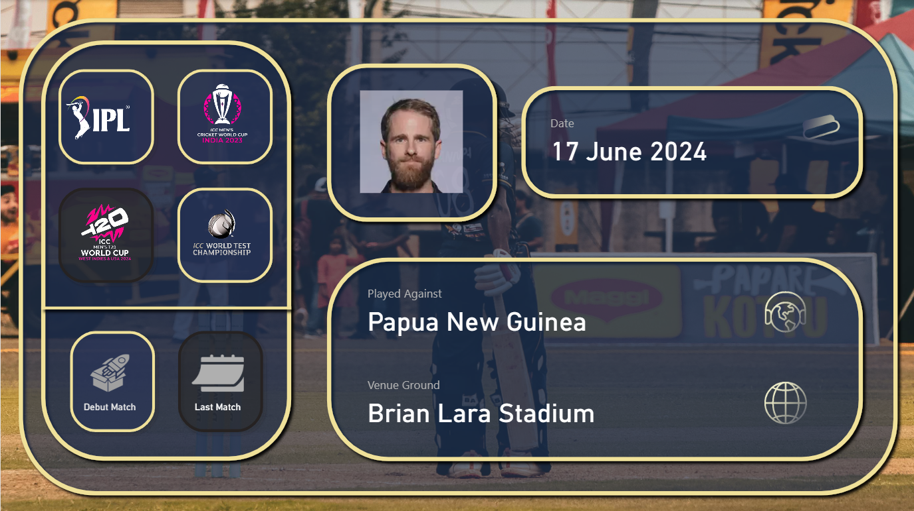
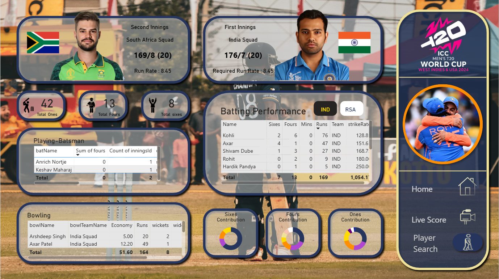
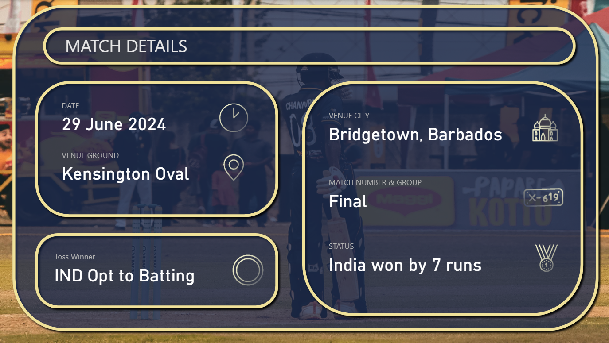
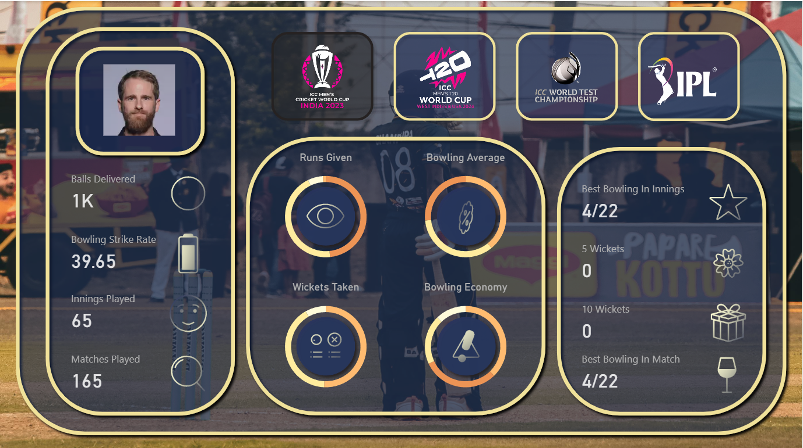
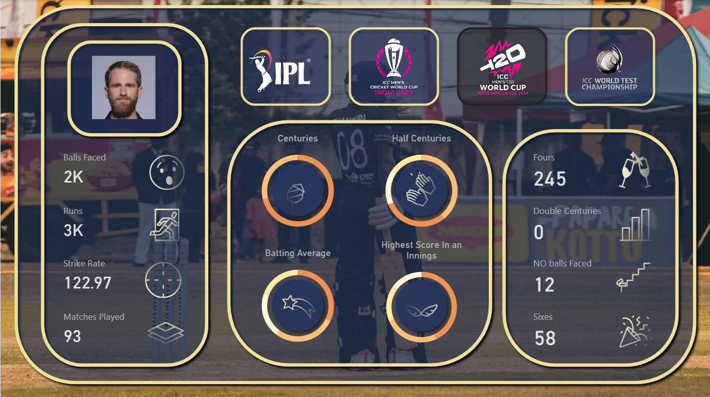

**🏏T20 World Cup 2024 Analytics**

This Power BI project delivers insightful visual analytics for the ICC Men's T20 World Cup 2024, covering player performance, team statistics, match results, and predictive insights. It is designed for cricket fans, analysts, and decision-makers who want to explore the tournament through interactive dashboards.

---

**📊 Features**

Player Generic summary : Get Generic Summary of the Player Through Search Bar,also as a tooltip when you hover over the player image.

--------------------------------------------------------------------------------------------------------------------------------------------------------------------------------------------------------------------

Player Whole Career Summary : Get Relevant Inforation about the Player's Debut Match and His Last Match Along With dates.

Match-by-Match Breakdown: Detailed analysis of each match with filters by team, date, venue.

Venue details & Toss Winner : Detailed and accurate information about the match venue,and toss winner and their decision.

Player Bowling Carrer Analysis: Detailed Analysis of each player bowling carrer across all the Formats.

Player Batting Carrer Analysis: Detailed Analysis of each player batting carrer across all the Formats.

**🧩 Data Sources**

Player performance datasets (e.g., Cricinfo, Kaggle)

RapidAPI,Cricbuzz

---

**🛠️ Technologies Used**

Power BI Desktop (.pbix)

DAX for calculated measures and KPIs

Power Query for data cleaning and transformation

---

**🚀 How to Use**

Download and open the .pbix file in Power BI Desktop.

Explore the dashboards using filters for teams, players, matches, and dates.

Use drill-throughs for deeper insights on specific matches or players.

---

**📌 Project Goals**

Provide a user-friendly interface to analyze World Cup data

Deliver real-time insights into player and team performance

Assist analysts, coaches, and fans in data-driven decision making

---

**📥 File Structure**

nginx
Copy
Edit
T20 World Project confident.pbix    # Main Power BI report

---

**🤝 Contributing**

If you’d like to contribute (e.g., update data, add visuals, or build predictive models), feel free to fork the project and submit a pull request.

---

**📬 Contact**

For suggestions or queries, please reach out at:
LinkedIn: [Sarvesh Chavan](https://linkedin.com/in/sarvesh-chavan)

---

**Note :-** Every Thing In the Project Is Dynamic and Can be filtered Accordingly along from player Details to Match Details.

---

**TO DOWNLOAD THE PROJECT :-**

[Download T20 World Project.pbix](https://drive.google.com/file/d/1U4U9c5_zmMCFWEUb2TkFC2GK2IRFomp4/view?usp=sharing)

